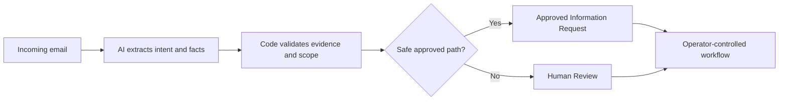

# My Office Intern

## Governed AI operations for repetitive email intake

**A working, independently built, evaluation-backed proof of concept.**

**Can AI reduce the time spent answering repetitive emails without creating new problems?**

My Office Intern explores that question one tightly governed operational task
at a time.

It reads inconsistent customer emails, identifies what information is present
or missing, prepares an approved first-contact response only when the evidence
supports it, and keeps investigation and consequential decisions with a human
operator.

Parking-management correspondence is the first proving ground. The larger idea
is a reusable governed intake approach for organizations that want meaningful
automation without allowing AI to become an uncontrolled company
representative.

## Verified milestone

| **96.0%** | **100.0%** | **0** |
|:---:|:---:|:---:|
| Routing accuracy | Auto-ready precision | False auto-ready outcomes |

The result comes from a fixed 100-email regression set with saved case content,
permanent case identifiers, and an operations-owned answer key. All four
remaining errors were conservative Human Review escalations; no Human Review
case was approved for template automation.

This is a controlled regression result, not a production-performance claim.

## Why this matters

Dedicated operational inboxes often receive large volumes of messages that need
the same initial response. The writing is repetitive, but understanding the
customer is not. People omit facts, attach partial evidence, reference earlier
conversations, use unfamiliar terminology, or describe one issue while asking
for help with another.

A general AI assistant can draft a plausible reply. Plausible is not the same
as governed, consistent, or safe to send.

My Office Intern tests a more useful middle ground:

- Automate eligibility and preparation for the narrow, approved information-gathering response.
- Prevent the model from freely composing automated customer wording.
- Route research, uncertainty, unsupported requests, and decisions to people.
- Measure the workflow against repeatable, operations-owned evidence.

The practical ambition is simple: enable an operator to focus on approximately
20 consequential cases instead of manually writing 100 repetitive replies,
while earning enough accuracy and consistency to be trusted.

## How it works

| Responsibility | Role |
|---|---|
| **AI understands** | Interprets inconsistent language and extracts evidence-backed information |
| **Rules control** | Validate the extraction, determine what may be automated, and select approved wording |
| **People decide** | Investigate company records, exercise judgment, and make consequential decisions |

**AI understands. Rules verify and control. People investigate and decide.**

## The first operational slice

The parking-management scenario performs one deliberately narrow job:

1. Read an incoming inquiry.
2. Interpret what the customer is asking and what evidence was supplied.
3. Validate the extraction against the email.
4. Determine whether the supported, approved information-request path applies.
5. Prepare consistent approved wording or retain the case for Human Review.

The system calls the approved response **Template Auto Ready**. It requests only
information that has not already been supplied. A Human Review outcome keeps the
case with an operator, whether or not the AI can also prepare a useful internal
brief.

## What the AI is never allowed to do

- Decide whether a violation is valid.
- Claim that an external company database was checked.
- Waive fees, approve appeals, or resolve disputes.
- Invent missing facts or supporting evidence.
- Freely compose an automated customer response.
- Override the deterministic safety gate.

These are product boundaries, not prompt suggestions.

## Built from an operations perspective

My Office Intern was conceived and built independently by **Olamide Aborowa,
MBA, PMP, PSM**, whose professional background is in operations rather than
corporate technology.

That perspective shaped the work: begin with the employee's real task, isolate
the smallest useful unit of automation, define where human judgment must remain,
and require measurable evidence before trusting the result.

The project demonstrates more than the ability to connect an inbox to an AI
model. It demonstrates workflow architecture, governance design, failure-mode
analysis, structured evaluation, implementation, and iterative operational
improvement.

## Beyond parking

The governed pattern may transfer to other dedicated intake workflows,
including:

- Insurance claim intake
- Maintenance and repair requests
- Billing inquiries
- Warranty claims
- Human-resources service requests
- Property-management correspondence

Each application would require its own approved scope, information needs,
templates, escalation rules, evaluation evidence, and human authority
boundaries. The goal is not a universal AI reply generator. It is a repeatable
way to build narrow operational automation that organizations can understand,
measure, and control.

## Current status

My Office Intern is a working local prototype and evaluation environment. It is
not presented as a production deployment. Current work focuses on preserving
safe automation precision, validating repeatability on fixed and fresh email
collections, improving operator experience and throughput, and testing whether
the architecture transfers cleanly to another governed workflow.

## Explore the research

- [Case study: When AI Wasn't the Hard Part](governed-ai-email-intake-case-study.md)
- [Evaluation methodology](docs/evaluation-methodology.md)
- [Governance model](docs/governance-model.md)

## Public repository scope

This repository shares the problem, research approach, governance model,
evaluation method, and selected verified results. Private source code, prompts,
answer keys, test emails, detailed routing logic, operating configuration,
credentials, and raw evaluation data are intentionally excluded.

## Connect

Thoughtful conversations with operations leaders, responsible-AI practitioners,
potential technical or research collaborators, employers, and organizations
exploring a governed workflow pilot are welcome.

[Connect with Olamide Aborowa on LinkedIn](https://www.linkedin.com/in/mideaborowa/)

© 2026 Olamide Aborowa. All rights reserved.
