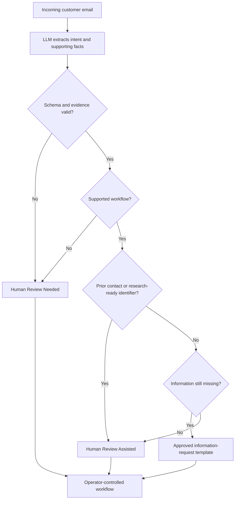

# My Office Intern

### Governed AI for repetitive operational email intake

My Office Intern explores a practical question:

> Can a company reduce the time employees spend answering repetitive emails without creating new operational problems?

The system uses an LLM to understand inconsistent customer language inside a tightly governed workflow. Deterministic code controls routing, approved wording, validation, and automation eligibility. Human operators retain authority over investigation and consequential decisions.

Parking-management inquiries are the first proving ground. The larger goal is a reusable governed-intake pattern for industries that depend on high-volume email correspondence but cannot accept unpredictable AI responses.

> **Showcase repository:** This public repository documents the product thesis, architecture, evaluation approach, and selected results. The production source code, prompts, credentials, customer data, and operational rule set are intentionally not included.

## The operating principle

| Layer | Responsibility |
|---|---|
| LLM | Understand messy email language, extract supporting facts, summarize intent, and identify missing information |
| Deterministic code | Validate extraction, enforce workflow rules, select approved wording, and gate automation |
| Operator | Investigate external company systems, approve consequential actions, and handle unsupported or uncertain cases |

The LLM is an analyst—not the decision-maker.

## Current operational slice

The initial capability handles parking-violation intake:

1. Read an incoming customer email.
2. Determine whether it belongs to the supported parking-violation workflow.
3. Extract evidence-backed information without inventing facts.
4. Determine whether the message is a first contact or an ongoing interaction.
5. Route the request using deterministic rules.
6. Use approved wording when a safe information request is appropriate.
7. Preserve human control whenever research, uncertainty, or an unsupported workflow is involved.

## Governed outcomes

### Template Auto Ready

Used for supported first-contact cases that lack enough information for an operator to investigate. Code assembles a pre-approved response and requests only information that has not already been supplied.

### Human Review Assisted

Used when an operator has enough information to research the matter, when prior correspondence exists, or when the workflow should prepare an operator brief rather than a customer-facing response.

### Human Review Needed

Used for malformed or uncertain extraction, unsupported use cases, and messages that do not safely fit the current operational slice.

## What the system deliberately does not do

- It does not decide whether a violation is valid.
- It does not claim to have checked an external company database.
- It does not waive fees, approve appeals, or resolve disputes.
- It does not allow emotional or legal language alone to dictate routing.
- It does not ask customers for evidence they already supplied.
- It does not allow the model to freely compose automatic customer responses.

## Evaluation evidence

### Preliminary engineering benchmark

A 20-case labeled engineering benchmark produced:

| Metric | Result |
|---|---:|
| Exact-case accuracy | 95.0% |
| Route accuracy | 100.0% |
| Extraction-field accuracy | 99.17% |
| Auto-ready precision | 100.0% |
| Eligible automation coverage | 100.0% |
| False auto-ready outcomes | 0 |

These figures are a preliminary engineering baseline—not a production accuracy claim. The labels remain subject to parking-operations owner approval, and the benchmark must be expanded and repeated before deployment decisions are made.

### Operational stress run

A separate 66-email run demonstrated meaningful routing separation:

- 23 approved information-request templates
- 9 Human Review Assisted outcomes
- 34 Human Review Needed outcomes
- No non-violation classification received an automatic template
- Every plausible violation number was routed to an operator

This run was used to discover edge cases; because it did not contain independently approved gold labels, it is not presented as an accuracy score.

Read the [evaluation methodology](docs/evaluation-methodology.md) and the updated [case study](Olamide-Aborowa_Building-a-95-Accurate-AI-Email-Responder_Case-Study.md).

## Why this pattern matters beyond parking

The same architecture can support narrowly defined intake workflows such as:

- Insurance claim intake
- Maintenance and repair requests
- Billing inquiries
- Warranty claims
- Human-resources service requests
- Property-management correspondence

Each organization supplies its own supported use cases, required facts, approved templates, escalation rules, and human decision boundaries. The reusable product is the governed workflow—not a universal AI reply generator.

## Product status

The project is currently a working local prototype and evaluation environment. Current work focuses on:

- Operations-approved evaluation labels
- Larger and more adversarial test sets
- Repeatability across multiple model runs
- Latency and throughput improvements
- Operator-interface clarity
- Auditability and measurable trust
- Careful expansion into one additional workflow at a time

## Technology overview

- Python application backend
- Schema-constrained local LLM extraction
- Deterministic routing and validation
- Vanilla JavaScript operator interface
- SQLite workflow state and audit history
- Read-only email intake integration

Implementation details are intentionally omitted from this public showcase.

## Project materials

- [Updated case study](Olamide-Aborowa_Building-a-95-Accurate-AI-Email-Responder_Case-Study.md)
- [Evaluation methodology](docs/evaluation-methodology.md)
- [Governance model](docs/governance-model.md)
- [Earlier architecture exploration — June 2026](Governed%20AI%20Email%20Workflow%20Architecture.png)

## Author

**Olamide Aborowa, MBA, PMP, PSM**

Product strategy, workflow architecture, governance design, implementation, and evaluation.
