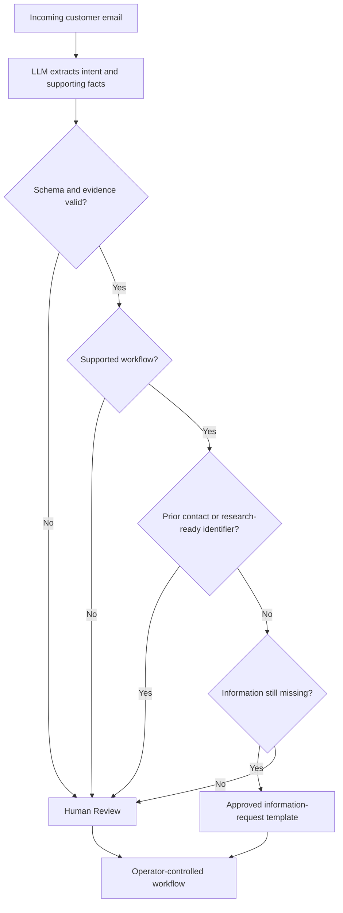

# My Office Intern

### Governed AI for repetitive operational email intake

My Office Intern explores a practical question:

> Can a company reduce the time employees spend answering repetitive emails without creating new operational problems?

The system uses an LLM to understand inconsistent customer language inside a tightly governed workflow. Deterministic code controls routing, approved wording, validation, and automation eligibility. Human operators retain authority over investigation and consequential decisions.

Parking-management inquiries are the first proving ground. The larger goal is a reusable governed-intake pattern for industries that depend on high-volume email correspondence but cannot accept unpredictable AI responses.

> **Showcase repository:** This public repository documents the product thesis, architecture, evaluation approach, and selected results. Private implementation code, prompts, credentials, customer data, and detailed operational rules are intentionally not included.

## The operating principle

| Layer | Responsibility |
|---|---|
| LLM | Understand messy email language, extract supporting facts, summarize intent, and identify missing information |
| Deterministic code | Validate extraction, enforce workflow rules, select approved wording, and gate automation |
| Operator | Investigate external company systems, approve consequential actions, and handle unsupported or uncertain cases |

The LLM is an analyst—not the decision-maker.

## Current operational slice

The initial capability handles parking-violation intake:

1. Read an incoming customer email.
2. Determine whether it belongs to the supported parking-violation workflow.
3. Extract evidence-backed information without inventing facts.
4. Determine whether the message is a first contact or an ongoing interaction.
5. Route the request using deterministic rules.
6. Use approved wording when a safe information request is appropriate.
7. Preserve human control whenever research, uncertainty, or an unsupported workflow is involved.

## Governed outcomes

### Template Auto Ready

Used for supported first-contact cases that lack enough information for an operator to investigate. Code assembles a pre-approved response and requests only information that has not already been supplied.

### Human Review

Used whenever an operator should retain the case: enough information exists for research, prior correspondence is involved, extraction is uncertain, or the message falls outside the supported automated path. The interface may indicate whether an operator brief is available, but the evaluation standard treats all such cases as Human Review.

## What the system deliberately does not do

- It does not decide whether a violation is valid.
- It does not claim to have checked an external company database.
- It does not waive fees, approve appeals, or resolve disputes.
- It does not allow emotional or legal language alone to dictate routing.
- It does not ask customers for evidence they already supplied.
- It does not allow the model to freely compose automatic customer responses.

## Evaluation evidence

The current process uses a fixed 100-email regression set with permanent case numbers, saved email content, and an operations-owned answer key. The same cases can be replayed independently of mailbox changes, while new inbox batches remain available for exploration. The interface reports batch progress during testing.

### Verified regression baseline — September 1, 2026

| Metric | Result |
|---|---:|
| Fixed cases | 100 |
| Route accuracy | 86.0% |
| Auto-ready precision | 91.2% |
| Eligible automation coverage | 88.6% |
| False auto-ready outcomes | 6 |
| Unnecessary human reviews | 8 |

All 100 rerun cases matched the fixed test collection, and every routing mismatch was reviewed against the saved email and operations-owned answer key. This is a controlled regression baseline—not a production-performance claim. Earlier exploratory tests were used to identify failure modes and are not presented as current performance.

Read the [evaluation methodology](docs/evaluation-methodology.md) and the updated [case study](governed-ai-email-intake-case-study.md).

## Why this pattern matters beyond parking

The same architecture can support narrowly defined intake workflows such as:

- Insurance claim intake
- Maintenance and repair requests
- Billing inquiries
- Warranty claims
- Human-resources service requests
- Property-management correspondence

Each organization supplies its own supported use cases, required facts, approved templates, escalation rules, and human decision boundaries. The reusable product is the governed workflow—not a universal AI reply generator.

## Product status

The project is currently a working local prototype and evaluation environment. Current work focuses on:

- Reducing false auto-ready outcomes toward zero
- Raising auto-ready precision and route accuracy above 95%
- Improving automation coverage without reducing precision
- Repeatability across multiple model runs
- Latency and throughput improvements
- Operator-interface clarity
- Auditability and measurable trust
- Careful expansion into one additional workflow at a time

## Technology overview

- Python application backend
- Schema-constrained local LLM extraction
- Deterministic routing and validation
- Vanilla JavaScript operator interface
- SQLite workflow state and audit history
- Read-only email intake integration

Implementation details are intentionally omitted from this public showcase.

## Project materials

- [Case study](governed-ai-email-intake-case-study.md)
- [Evaluation methodology](docs/evaluation-methodology.md)
- [Governance model](docs/governance-model.md)

## Author

**Olamide Aborowa, MBA, PMP, PSM**

Product strategy, workflow architecture, governance design, implementation, and evaluation.
