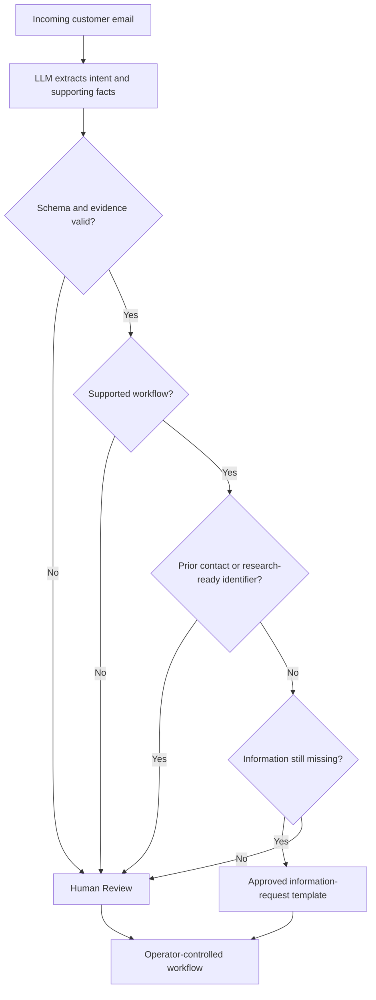

# My Office Intern

## An evaluation-backed governed AI operations system

My Office Intern is a working prototype designed to reduce repetitive email handling without giving AI authority to make business decisions or freely write customer responses.

It reads inconsistent customer messages, identifies what information is present or missing, prepares an approved information request only when automation is safe, and routes everything requiring investigation or judgment to a person.

Parking management is the first proving ground. The underlying workflow is intended for other high-volume intake operations that need the efficiency of AI without unpredictable customer communication.

### Verified 100-email regression milestone

- **96 of 100** emails were sent to the correct workflow.
- **100% precision** among emails approved for an automated response.
- **Zero** cases requiring human review were incorrectly approved for automation.

This is a controlled regression result, not a production-performance claim.

## How it works

| Responsibility | What happens |
|---|---|
| AI understands | Interprets inconsistent language and extracts evidence-backed information |
| Rules control | Validate the extraction, determine what may be automated, and select approved wording |
| People decide | Investigate company records, exercise judgment, and make consequential decisions |

In plain terms: **AI understands. Rules verify and control. People investigate and decide.**

### A simple example

If a first-contact email does not provide enough information to locate and investigate the matter, the system prepares an approved response requesting only the missing information. If the message is research-ready, uncertain, part of an existing interaction, or outside the supported workflow, it goes to Human Review.

## Current operational slice

The initial capability handles parking-violation intake:

1. Read an incoming customer email.
2. Determine whether it belongs to the supported parking-violation workflow.
3. Extract evidence-backed information without inventing facts.
4. Determine whether the message is a first contact or an ongoing interaction.
5. Route the request using deterministic rules.
6. Use approved wording when a safe information request is appropriate.
7. Preserve human control whenever research, uncertainty, or an unsupported workflow is involved.

## Governed outcomes

### Approved information request

The system labels this outcome **Template Auto Ready**. It is used for supported first-contact cases that lack enough information for an operator to investigate. Code assembles a pre-approved response and requests only information that has not already been supplied.

### Human Review

Used whenever an operator should retain the case: enough information exists for research, prior correspondence is involved, extraction is uncertain, or the message falls outside the supported automated path. The interface may indicate whether an operator brief is available, but the evaluation standard treats all such cases as Human Review.

## What the system deliberately does not do

- It does not decide whether a violation is valid.
- It does not claim to have checked an external company database.
- It does not waive fees, approve appeals, or resolve disputes.
- It does not allow emotional or legal language alone to dictate routing.
- It does not ask customers for evidence they already supplied.
- It does not allow the model to freely compose automatic customer responses.

## Evaluation evidence

The current process uses a fixed 100-email regression set with permanent case numbers, saved email content, and an operations-owned answer key. The same cases can be replayed independently of mailbox changes, while new inbox batches remain available for exploration. The interface reports batch progress during testing.

### Verified regression milestone: September 2026

| Metric | Result |
|---|---:|
| Fixed cases | 100 |
| Correct routes | 96 |
| Route accuracy | 96.0% |
| Auto-ready precision | 100.0% |
| Eligible automation coverage | 94.2% |
| False auto-ready outcomes | 0 |
| Unnecessary human reviews | 4 |

Workflow version 1.3 was evaluated against the exact fixed collection and operations-owned answer key. All four remaining errors were conservative human-review escalations; no human-review case was incorrectly automated.

Read the [evaluation methodology](docs/evaluation-methodology.md) and the updated [case study](governed-ai-email-intake-case-study.md).

## Why this pattern matters beyond parking

The same architecture can support narrowly defined intake workflows such as:

- Insurance claim intake
- Maintenance and repair requests
- Billing inquiries
- Warranty claims
- Human-resources service requests
- Property-management correspondence

Each organization supplies its own supported use cases, required facts, approved templates, escalation rules, and human decision boundaries. The reusable product is the governed workflow, not a universal AI reply generator.

## Product status

The project is currently a working local prototype and evaluation environment. Current work focuses on:

- Preserving zero false auto-ready outcomes
- Testing repeatability and performance on fresh email collections
- Improving automation coverage without reducing precision
- Latency and throughput improvements
- Operator-interface clarity
- Auditability and measurable trust
- Careful expansion into one additional workflow at a time

## Technology overview

- Python application backend
- Schema-constrained local LLM extraction
- Deterministic routing and validation
- Vanilla JavaScript operator interface
- SQLite workflow state and audit history
- Read-only email intake integration

## Project materials

- [Case study](governed-ai-email-intake-case-study.md)
- [Evaluation methodology](docs/evaluation-methodology.md)
- [Governance model](docs/governance-model.md)

## Public repository scope

This repository documents the system's purpose, architecture, evaluation approach, and selected verified results. Private implementation code, prompts, credentials, customer data, detailed operational rules, and raw test materials are intentionally not included.

## Author

**Olamide Aborowa, MBA, PMP, PSM**

Product strategy, workflow architecture, governance design, implementation, and evaluation.
